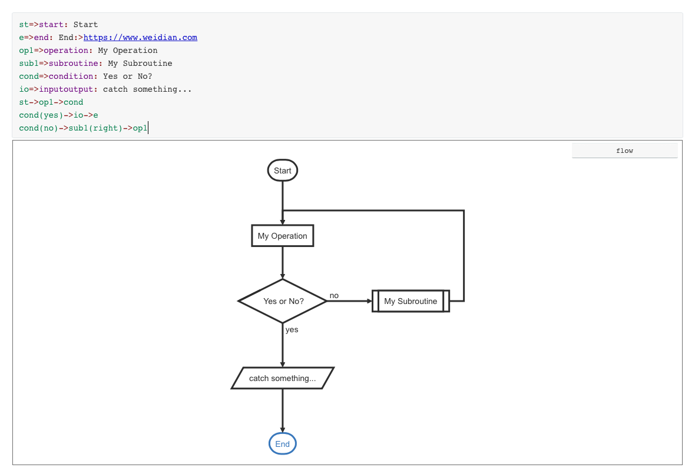

# markdown语法

markdown是一种轻量级标记语言，用纯文本的方式编写文档。感受是像写代码一样，写文档。

## 标题
```
使用#+空格来设置标题，最多支持六级标题
# 1
## 2
### 3
#### 4
##### 5
###### 6
```
效果如下
### 3
#### 4
##### 5
###### 6
## 列表
```
无序列表：- + * + 空格
有序列表：1. 2. + 空格
列表嵌套：上级下级之间三个空格
```
- 无序列表
* 无序列表
   + 嵌套列表
   
   
1. 有序列表
2. 有序列表
   1. 有序嵌套列表

## 字体
```
**加粗**
*倾斜*
***加粗倾斜***
~~删除线~~
```
**加粗**
*倾斜*
***加粗倾斜***
~~删除线~~

## 引用
```
>引用内容
>>引用了引用的引用
```
>引用内容
>>引用了引用的引用

比较屌的是，你可以一直引用
>引用内容
>>引用了引用的引用
>>>一直引用


## 分割线
```
三个或三个以上-
三个或三个以上*
```
---------
这是分割线
***
## 图片
```

```
效果：


## 超链接
```
[文本](连接地址)
```
[微店](https://www.weidian.com)

## 表格
```
|表头|表头|表头|
|对齐|对齐|对齐|
|内容|内容|内容|
|内容|内容|内容|
表头与内容之间使用-来对齐
可以指定内容文字对齐方式：
:-左对齐
:-:为居中对齐
-:为右侧对齐
```
表格：

|名称|性别|年龄|
|:--|:--:|--:|
|小|男|二十|
|老|男|四十|
|小小|男|十|

## 代码
单行代码：使用反引号`包起来

代码块：使用三个反引号包起来```

```
    public synchronized void start() {
        if (!this.monitorActive) {
            this.lastTime.set(milliSecondFromNano());
            long localCheckInterval = this.checkInterval.get();
            if (localCheckInterval > 0L) {
                this.monitorActive = true;
                this.monitor = new GlobalChannelTrafficCounter.MixedTrafficMonitoringTask((GlobalChannelTrafficShapingHandler)this.trafficShapingHandler, this);
                this.scheduledFuture = this.executor.schedule(this.monitor, localCheckInterval, TimeUnit.MILLISECONDS);
            }
        }
    }
```
## 流程图
```
流程图使用三个反引号+flow + 三个反引号包裹起来
语法分为，定义元素和连接元素两个部分
定义元素：tag=>type: content:>url
tage为标签，一般为流程的英文缩写
type为类型：start end operation subroutine condition inputoutput 这六种
content是文本框中的内容
url是一个链接，点击文本时可以跳转到链接页
```
定义元素
```
st=>start: Start
e=>end: End:>https://www.weidian.com
op1=>operation: My Operation
sub1=>subroutine: My Subroutine
cond=>condition: Yes or No?
io=>inputoutput: catch something...
```
连接元素
```
st->op1->cond
cond(yes)->io->e
cond(no)->sub1(right)->op1
```
效果：
