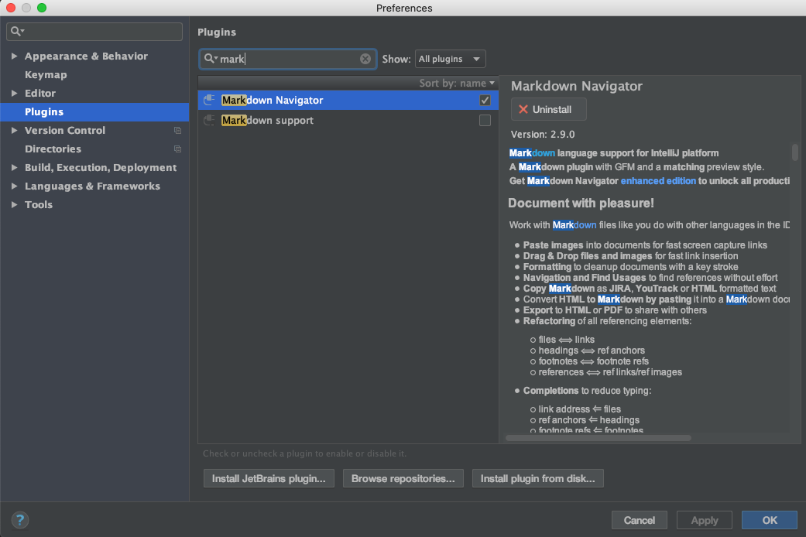
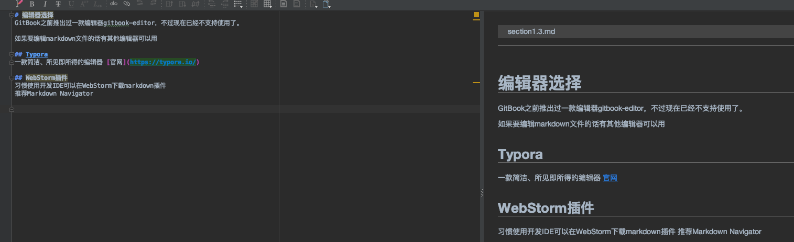

# 编辑器选择
GitBook之前推出过一款编辑器gitbook-editor，不过现在已经不支持使用了。

如果要编辑markdown文件的话有其他编辑器可以用

## Typora
一款简洁、所见即所得的编辑器 [官网](https://typora.io/)

## WebStorm插件
习惯使用开发IDE可以在WebStorm下载markdown插件
推荐Markdown Navigator

WebStorm->plugin->install

安装完成后，重启IDE，再编写markdown文档时，效果如下：

