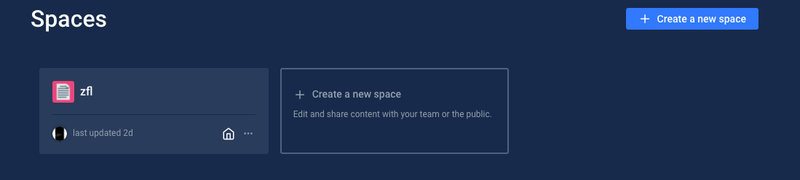
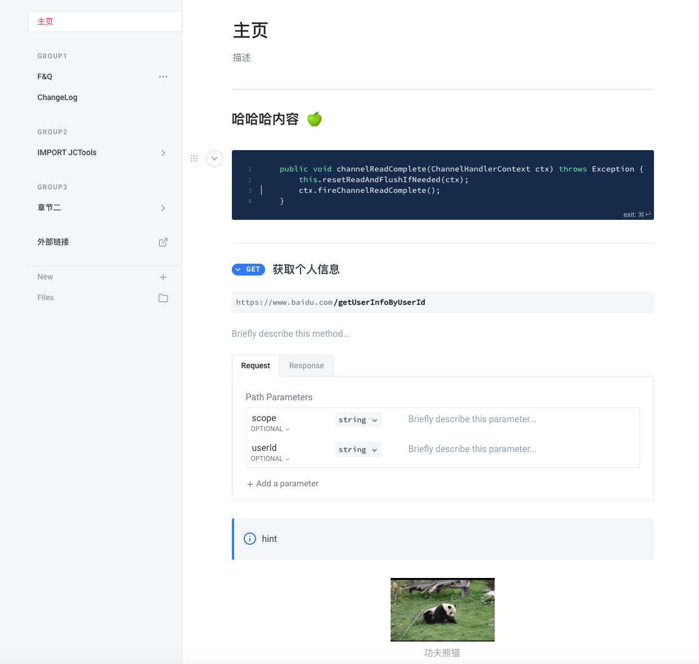

# 官网

定义：现代化的文档平台，团队可以在其中记录从产品到内部知识库和api的所有内容

[gitbook官网](https://www.gitbook.com/)可在线编写电子书、并提供托管、协作功能。

## Spaces

gitbook官网使用Space作为最小单元进行内容管理
每个space对应一个文档

## 在线编辑器

在线编辑器支持hint、APIMethod、代码块、富文本、视频嵌入等功能
让文档编辑变的简单高效

