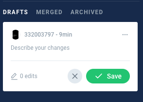
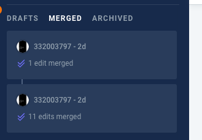
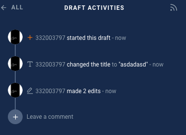
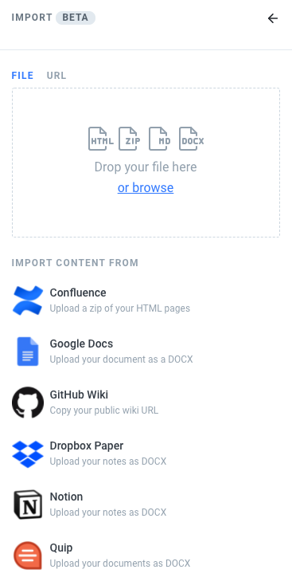
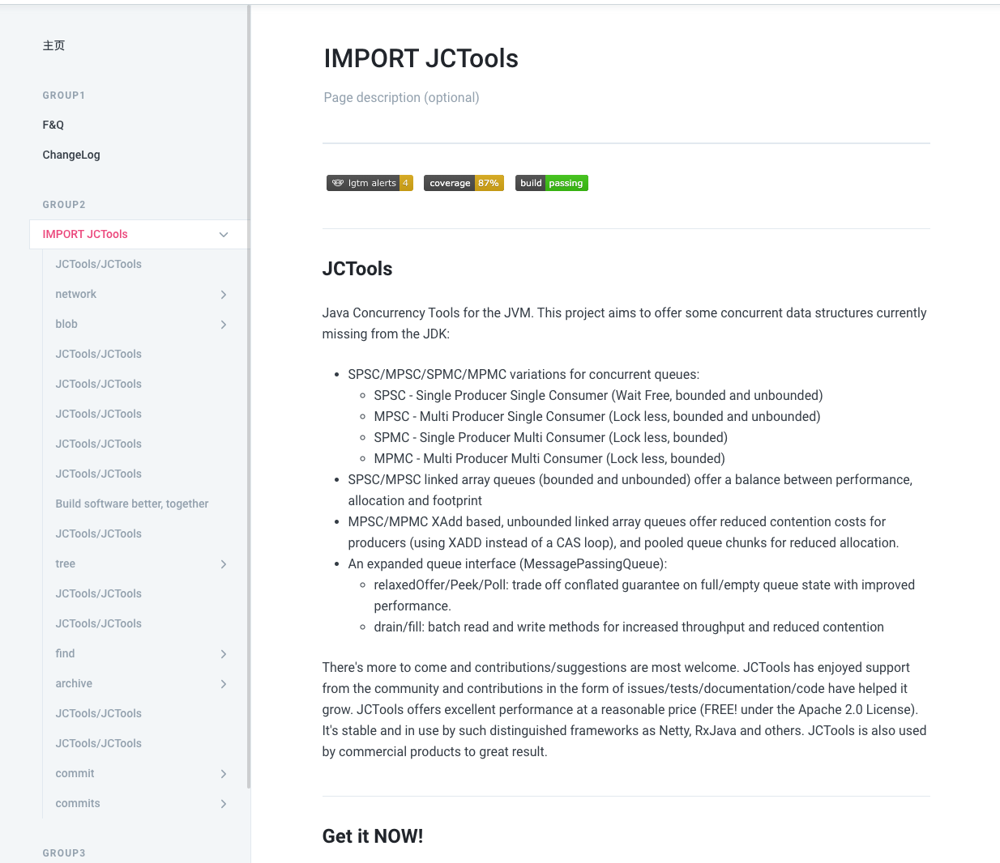

# 特性

## 协作
允许团队同时进行文档编写，并最终合并。对提交记录进行记录，还可以添加评论、方便交流

等同于git对代码的管理

### draft
每个操作者操作的内容，先以草稿的方式记录

### merge
确认编写内容无误后，保存 进行merge操作

### activites
操作记录都会被记录下来，也可以添加评论做交流

## 导入

支持从网站或本地导入markdown、html、docx格式的文件

### 导入JCTools的介绍

下面是我导入JCTools介绍文档的例子，十分简单

复制[JCTools介绍地址](https://github.com/JCTools/JCTools#readme)

到URL框内，点击执行，等待结束

## 可分享链接

可以将私有文档内容，生成秘密链接，分享给别人。

## 其他特性
还支持国际化、与github、google搜索集成、品牌定制等功能。😄

[features](https://docs.gitbook.com/features)可自行探索
