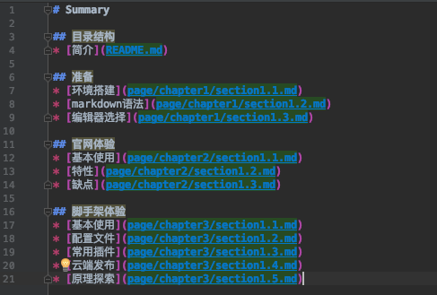
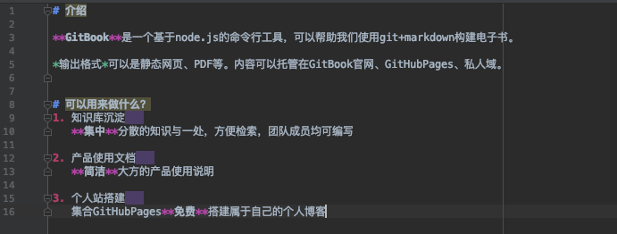
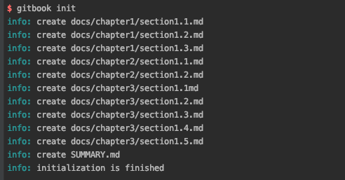
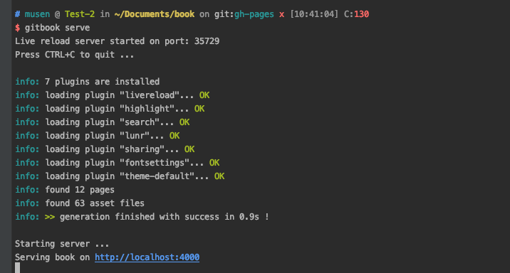
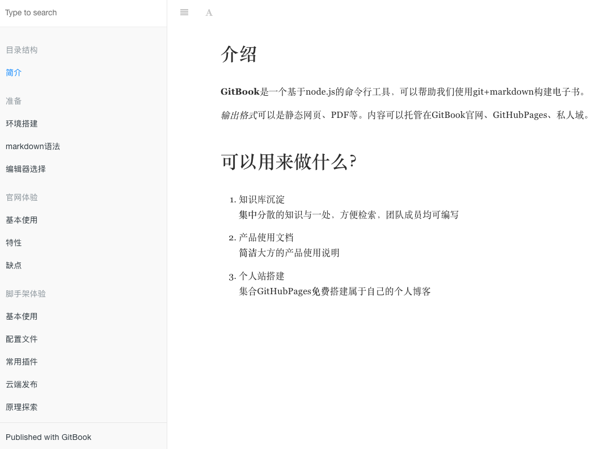

# 基本使用

搭建好环境后，我们可以直接使用命令行工具在本地创建电子书

当前这个页面就是使用命令行+githubpages发布出来的

## 初始化
- 创建一个存放电子书的目录

- 创建SUMMARY.md文件

用来定义整个书籍的目录

- 创建README.md文件

首页内容

- 执行初始化命令:gitbook init

执行后，会按照summary中的定义，创建目录和md文件

- 执行命令:gitbook serve 本地预览效果

在浏览器中打开

## 命令行源码

源码是开放的[源码](https://github.com/GitbookIO/gitbook-cli)
