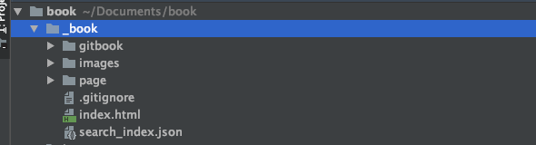
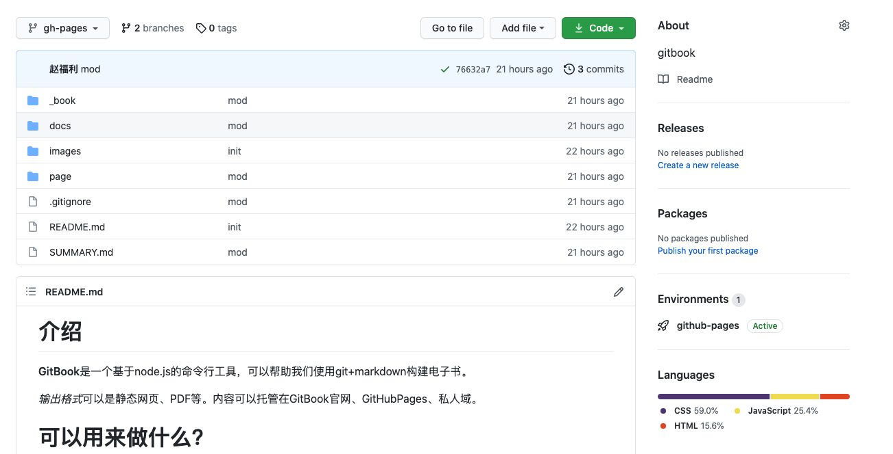
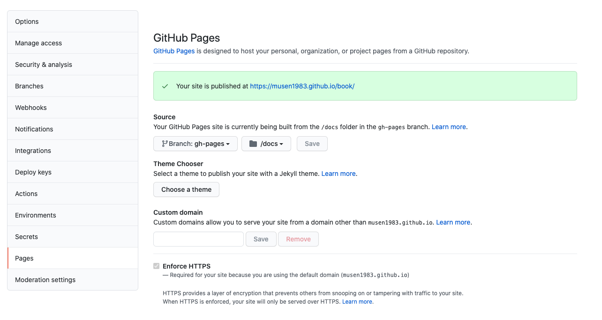

# 云端发布

gitbook.com上可以支持我们托管发布，除了这个之外，还可以发布到githubpages

之前比较流行的是使用hexo+github搭建个人站 参考[hexo搭建个人站](https://zhuanlan.zhihu.com/p/35668237)


## HEXO

之前搭建的[个人站](https://musen1983.github.io/) 体验上不是特别好，比较麻烦

## 使用GitBook发布

命令行执行

```
gitbook build
```
可以看到生成了_book文件夹，里面是资源文件



所以我们的任务就是将这些资源文件，发布到githubpages上存放起来

登录github，创建一个新的Repository来存放我们**build**后的代码。

创建一个**gh-pages**分支

执行 gitbook build . docs

这个命令是将编译后的文件放到docs文件夹内

之后全部提交到github



提交成功后，打开Repository中的settings选项

找到GitHub Pages 选择我们刚提交过的gh-pages分支 和 docs文件夹



>[!note]
>最后，访问发布页即可


